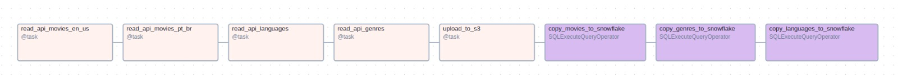

 

# 🎬 TMDB API Data Pipeline

This project deliberately **over-engineers** a modern data pipeline that extracts, loads, and transforms data from the TMDB API into Snowflake. It leverages tools such as Terraform, S3, Apache Airflow, dbt, Metabase, Docker, and GitHub Actions to simulate a full production-like workflow.
---

## 🚀 Project Overview

- **Source**: TMDB API (Trending Movies, Genres, Languages)
- **Ingestion**: Airflow DAGs orchestrate API calls and load raw JSON data into S3 and then into Snowflake using `COPY INTO`
- **Transformation**: dbt models normalize, flatten, and enrich the raw data
- **Infrastructure**: Terraform provisions Snowflake resources such as roles, schemas and also creates the raw tables
- **Monitoring**: dbt tests and GitHub Actions ensure code and data quality through CI/CD workflows
- **Visualization**: Metabase connects to Snowflake for dashboarding

  

---

## 🧱 Tech Stack

| Tool                | Purpose                                         |
|---------------------|-------------------------------------------------|
| Airflow             | Orchestrates ingestion and dbt transformation   |
| Docker & Astro CLI  | Local development environment                   |
| AWS S3              | Raw data storage and staging layer              |
| Snowflake           | Cloud data warehouse                            |
| dbt                 | SQL-based data transformation and testing       |
| Terraform           | Infrastructure as Code for Snowflake setup      |
| GitHub Actions      | CI/CD pipeline to run validations     |
| Metabase            | Simple BI layer for dashboarding                |
| Astronomer Cosmos   | Executes dbt models in Airflow task-by-task     |

---

## 📚 Project Description

This project was created to learn and explore modern data engineering tools through hands-on experimentation. The initial stack consisted of Snowflake, dbt, and Airflow. As the project evolved, Terraform was introduced to manage infrastructure as code, making it easier for others to reproduce the Snowflake setup with minimal manual steps.

One of the key decisions was selecting a good API source. I chose the [TMDB API](https://developer.themoviedb.org/) for its useful but non-trivial structure, allowing for real data modeling challenges. The DAG pulls trending movies (`/trending/movie/day`), along with language and genre metadata (`configuration/languages`and `genre/movie/list`). It retrieves data for both Brazil and the USA to allow comparison.

Metabase was added to simulate the dashboarding step typical in production workflows. It was chosen for its easy Docker setup and native Snowflake support.

> 💡 _Result: Movie preferences between Brazil and the USA are surprisingly similar._

  

---

## ⚙️ Workflows and Automation

GitHub Actions was integrated to provide CI/CD for:
- Validating Terraform plans
- Running `dbt compile` and `dbt test`

Each time a push or pull request modifies files in the `dbt/` or `terraform/` directories, the relevant workflow is triggered. Status badges for these workflows are shown at the top of this README.

S3 was used as both backup and staging layer (aligned with the medallion architecture concept of **staging → bronze → silver → gold**).

---

## 🧩 Airflow DAGs

Two DAGs orchestrate the flow:

### 1. API Ingestion DAG
- Calls the TMDB API
- Stores raw files in S3
- Immediately loads them into Snowflake using `SQLExecuteQueryOperator`

  

---

### 2. dbt Transformation DAG
- Runs `dbt` using [Astronomer Cosmos](https://astronomer.github.io/astronomer-cosmos/)
- Each dbt model becomes an independent Airflow task
- Solves the traditional “dbt as one Airflow task” limitation

  

---

## 🔍 Final Thoughts

This project was born out of a desire to practice and deepen my skills in **dbt**, **Snowflake**, and **Airflow**. Over time, it grew to include:
- Terraform for Snowflake setup
- GitHub Actions for automation and testing
- Metabase for visualization

By combining these tools, the pipeline mimics the end-to-end process you'd find in a real-world data platform. I hope this serves as a reference or starting point for anyone looking to learn these tools hands-on. I am also trying to learn as much as I can about this tools, so if you have any suggestions, please reach out!